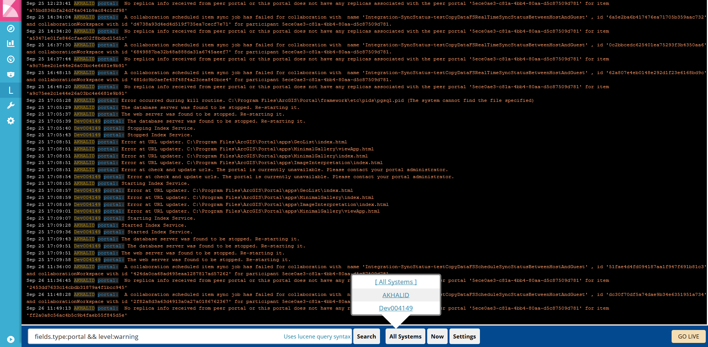

# LogTrail4AGS: Better ArcGIS Logs
 Use the Elastic Stack (previously ELK) to improve ArcGIS stack log visibility and monitoring.  Quickly and efficiently view logs spanning many machines by using the speed of elastic, the querying power of lucene and the beauty of kibana.  
 

The added customizations in this repo use default locations of logs and provide: 
- log level coloring and easy filtering by level using: `level:{error|warning|info|debug}`
- product filtering using: `fields.type:{portal|server}`
- machine filtering using: `host:dev004149`
- automatic log date transforms so that elastic displays the currect datetime of the log

## Features
- View, analyze and search log events from a centralized interface
- Clean & simple devops friendly interface
- Live tail
- Filter aggregated logs by hosts and program
- Quickly seek to logs based on time
- Supports highlighting of search matches
- Supports multiple Elasticsearch index patterns each with different schemas
- Can be extended by adding additional fields to log event
- Color coding of messages based on field values  
From: https://github.com/sivasamyk/logtrail

## Requirements
 - elasticsearch
 - filebeat
 - logstash
 - kibana
 - logtrail

## Get Started
### Install Dependencies
You will need to choose a host machine which will be where you view all the logs.  Then go ahead and install the elastic stack on the host machine:  
1. install elasticsearch: https://www.elastic.co/guide/en/elasticsearch/reference/5.6/install-elasticsearch.html  
2. install kibana: https://www.elastic.co/guide/en/kibana/5.6/install.html  
3. install logstash: https://www.elastic.co/guide/en/logstash/5.6/installing-logstash.html  
4. install filebeat: https://www.elastic.co/guide/en/beats/filebeat/5.6/filebeat-installation.html  
5. install logtrail plugin for kibana: `./bin/kibana-plugin install   https://github.com/sivasamyk/logtrail/releases/download/v0.1.21/logtrail-5.6.1-0.1.21.zip`  

### Configure for ArcGIS Logging
Add this repo's filebeat.yml to your filebeat install dir.  Run filebeat:  
`filebeat.exe -e -c filebeat.yml -d 'publish'`

Add this repo's logstash-arcgis-pipeline.conf to your logstash install dir. Run logstash:  
`bin\logstash -f logstash-arcgis-pipeline.conf --config.reload.automatic`

Add this repo's logtrail.json to `kibana\plugins\logtrail`.  Run kibana:  
`bin\kibana.bat`

Open kibana & navigate to logtrail from left nav menu:   
`http://localhost:5601`

#### Add Logs From Other Machines
You can easily add other machines' logs by simply insalling filebeat on that machine and running the above filebeat configuration but be sure to change the line for the log output (in filebeat.yml) to be to your host machine, so it would be something like: `hosts: ["akhalid.esri.com:5044"]`.  Now your new machine will send logs to your host machine's logstash.

#### Deploying docker filebeat
Simply run:  
`docker-compose -f docker-compose-filebeat.yml up -d`

## Clean up
If you want to cleanup filebeat logs, run:
`rm data\registry data\registry.old`

If you want to cleanup log data in your elasticsearch, you'll need to download and install elasticsearch-curator and then run:  
`curator.exe delete-logstash.yml --config curator.yml`

## Notes
- the curr impl only aggregates logs from: Portal, Server
